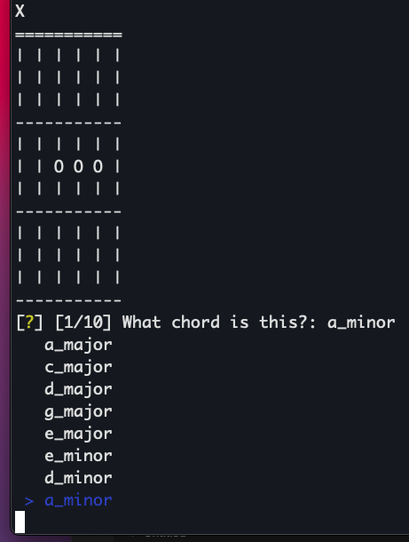

# guitar-chord-flash-card-cli

Simple guitar chord flash card learning program. I'm learning the guitar and wrote this while waiting for my fingers to recover. Hopefully, this'll help me to memorise the chords.

It renders an ASCII representation of the fret board for a given chord and asks the user to identify the chord. The chords are randomly selected from a small chord dictionary and the answers are multiple choice. The quiz contains 10 questions, scored at the end.



## Building

Python version: >=3.0

```sh
pip install -r requirements.txt
python main.py
```

## Extending (adding chords)

Add new chords to the hard-coded dictionary returned by `get_chords` by adding a new key/value pair of the following format:

```python
    'a_minor': [
      [2],
      [3, 4],
    ]
```

where `a_minor` is the unqiue key for the chord and the value is an array of sequentially ordered arrays. Each child array represents a fret on the fret board (index 0 = fret 1, index 1 = fret 2 etc). Each element within each child array represents the integer value of the string that should be pressed on the fret board (duplicates do not matter) for the current fret. A blank child array will render the current fret with no strings pressed.

## License

MIT